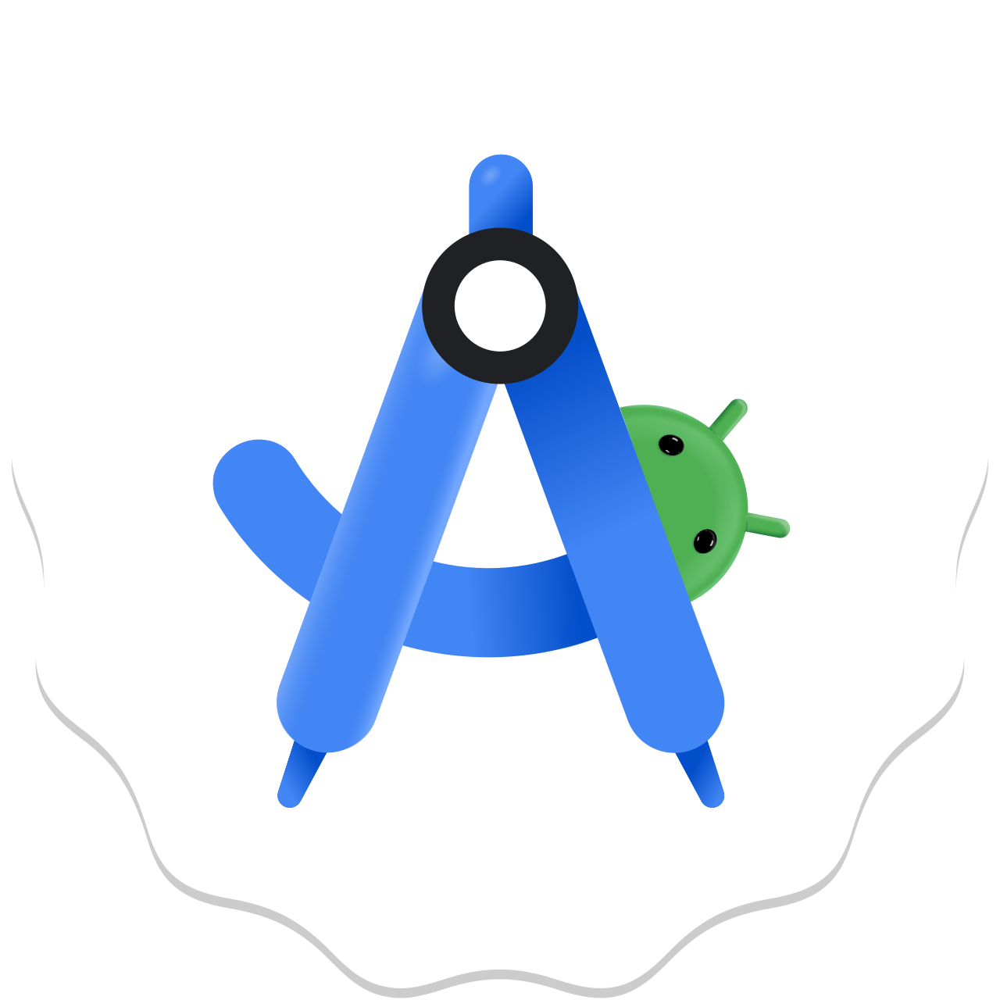
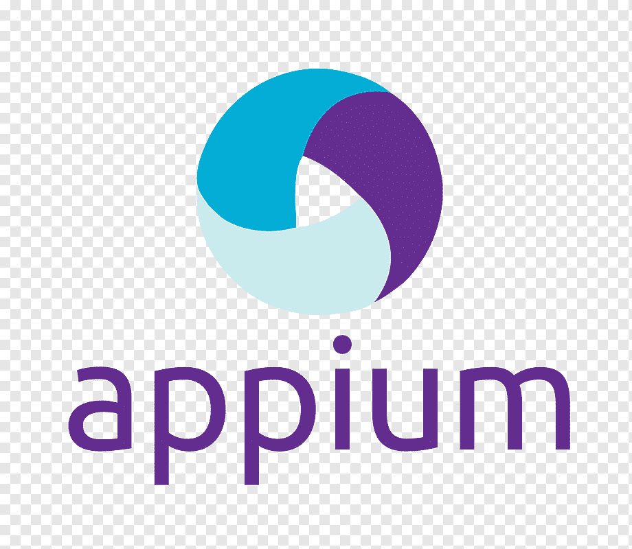
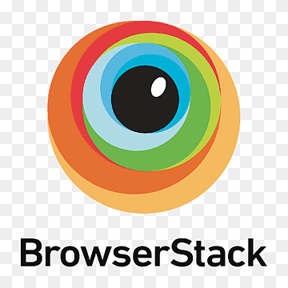
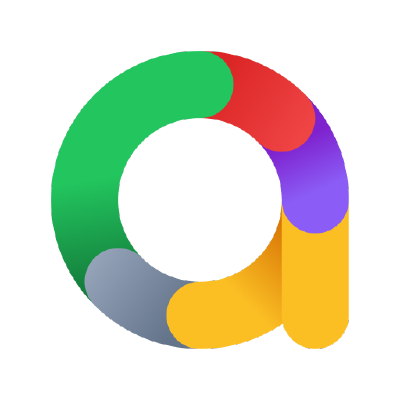
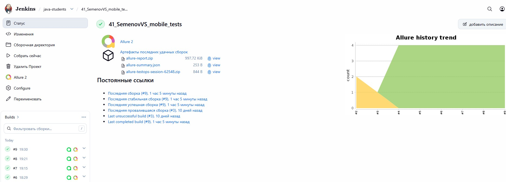
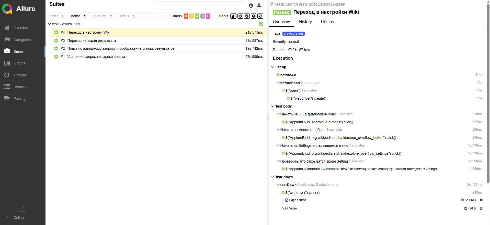
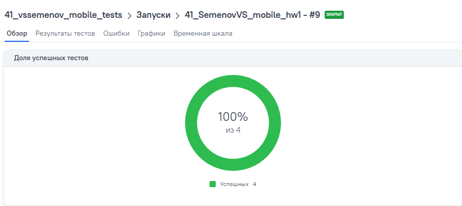
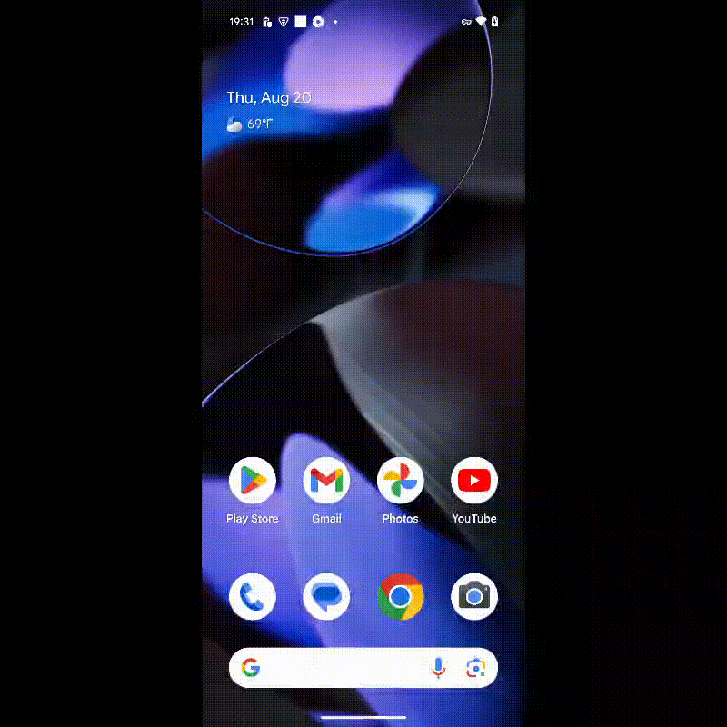

# Автоматизированные тесты для мобильного приложения Wiki
<p align="center">  
<a href="https://telegram.org/"></a>  
</p>

## Содержание

* <a href="#description">Описание</a>
* <a href="#tools">Технологии и инструменты</a>
* <a href="#jenkins">Сборка в Jenkins</a>
* <a href="#console">Инструкция по запуску из терминала</a>
* <a href="#allure">Allure отчет</a>
* <a href="#allure-testops">Интеграция с Allure TestOps</a>
* <a href="#video">Пример видео выполнения тестов в browserstack</a>
  <a id="description"></a>

## Описание:

Автоматизированные тесты для мобильного приложения Wiki. Покрытые сценарии:
1. Поиск по валидному запросу и отображение списка результатов
2. Удаление запроса в строке поиска
3. Переход в настройки Wiki
4. Переход на экран результата
5. Проверка экранов onboarding screen

<a id="tools"></a>
## <a name="Технологии и инструменты">**Технологии и инструменты:**</a>

<p align="center">  
<a href="https://www.jetbrains.com/idea/"></a>
<a href="https://developer.android.com/studio"></a>  
<a href="https://appium.io/"></a>  
<a href="https://www.browserstack.com/"></a>
<a href="https://www.java.com/"></a>   
<a href="https://junit.org/junit5/"></a>  
<a href="https://gradle.org/"></a> 
<a href="https://github.com/"></a> 
<a href="ht[images](images)tps://github.com/allure-framework/allure"></a>   
<a href="https://www.jenkins.io/"></a>  
</p>


____
<a id="jenkins"></a>
## </a><a name="Сборка"></a> Сборка в [Jenkins](https://jenkins.qa.guru/view/java-students/job/41_SemenovVS_mobile_tests/)</a>
____
<p align="center">  
<a href="https://jenkins.qa.guru/view/java-students/job/41_SemenovVS_mobile_tests/"></a>  
</p>

<a id="console"></a>
## Команды для запуска из терминала
___

***Локальный запуск:***
**Подготовка:**
1. Установить [android studio](https://developer.android.com/studio)
2. В Android studio перейти в SDK Manager и скачать 11 android
3. В AVD Manager скачать образ Pixel 4 для 11 android
4. Установить [node.js](https://nodejs.org/en/download)

**Запуск:**
1. Запустить [Appium Server](https://github.com/appium/appium): ```appium --base-path /wd/hub```
2. Запустить эмулятор: ```emulator -avd Pixel_4```
3. Запустить тесты: ```./gradlew -DdeviceHost=emulator```


***Удалённый запуск через browserstack:***
```bash  
./gradlew -DdeviceHost=browserstack
```
___
<a id="allure"></a>
## </a> <a name="Allure"></a> [Allure-отчет](https://jenkins.qa.guru/view/java-students/job/41_SemenovVS_mobile_tests/9/allure/)</a>
___

### *Тест-кейсы*

<p align="center">  
  
</p>

___
<a id="allure-testops"></a>
## </a> Интеграция с <a target="_blank" href="https://allure.autotests.cloud/project/5151/dashboards"> Allure TestOps</a>
____
### *Allure TestOps Dashboard*

<p align="center">  
  
</p>  

### *Авто тест-кейсы*

<p align="center">  
  
</p>

____
<a id="video"></a>
### *Пример видео выполнения тестов в browserstack*
____
<p align="center">
   
</p>
